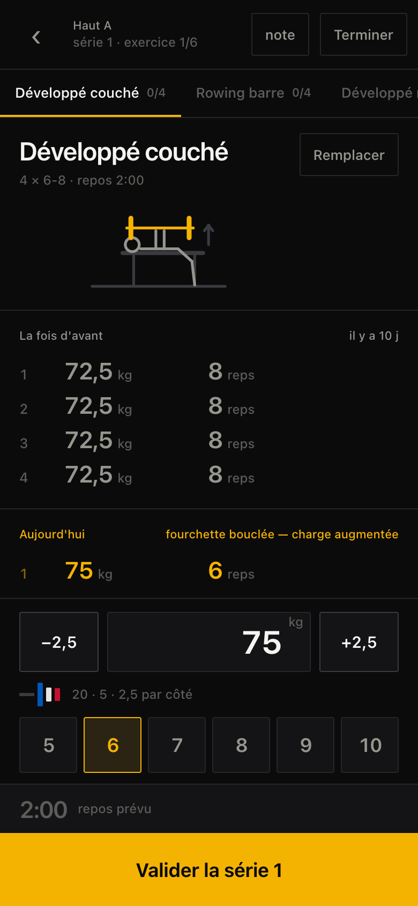
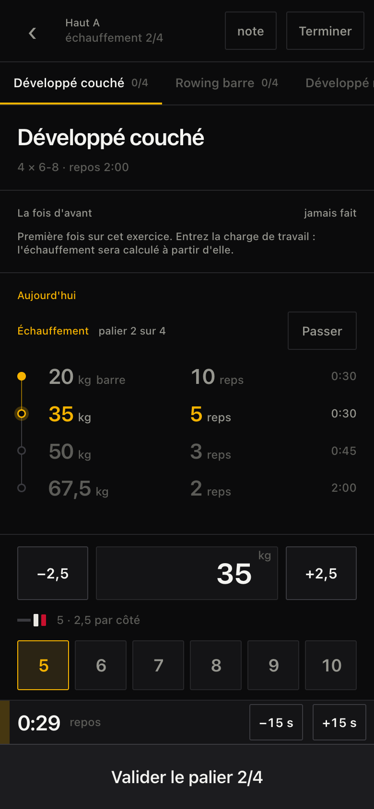
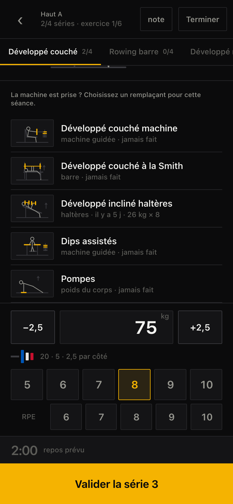
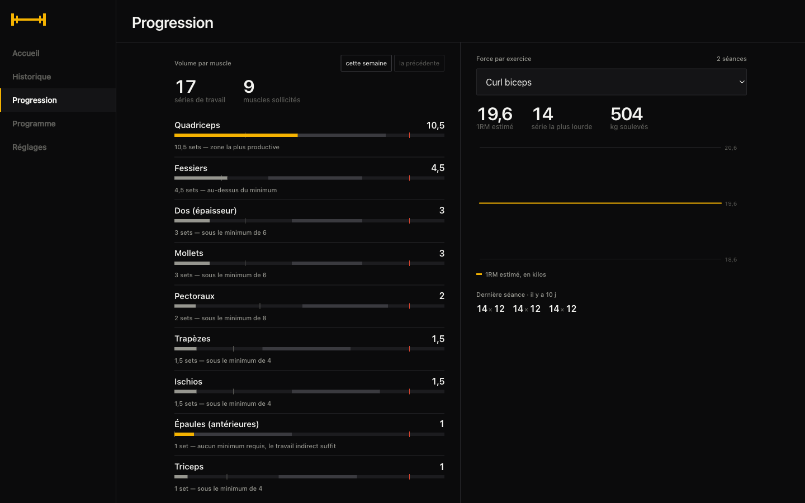
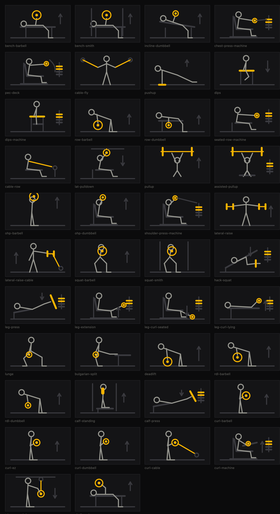

# Turi Kout

Suivi de musculation et de nutrition, auto-hébergé, mono-utilisateur, conçu pour
fonctionner sans réseau.

[](https://github.com/GreemSC/turi-kout/actions/workflows/ci.yml)
[](https://github.com/GreemSC/turi-kout/actions/workflows/image.yml)
[](LICENSE)

Deux usages, deux contraintes. **En salle, sur téléphone** : logger une série
doit prendre moins de trois secondes et fonctionner en mode avion. **À la
maison, sur ordinateur** : consulter les courbes et ajuster le programme. Tout
le reste est subordonné au premier.

<p align="center">
  
  
  
</p>

---

## Déploiement

### Depuis les sources — aucune authentification

```bash
git clone https://github.com/GreemSC/turi-kout.git && cd turi-kout
docker compose up -d --build
docker compose logs turi-kout | grep -A2 "Jeton genere"
```

C'est le chemin le plus court si le serveur peut construire l'image lui-même.

### Depuis l'image publiée — plus rapide, mais authentifiée

CI publie une image multi-architecture (amd64 et arm64) sur
`ghcr.io/greemsc/turi-kout`. Le dépôt étant privé, **le paquet l'est aussi** : il
faut s'identifier auprès du registre avec un jeton portant `read:packages`.

```bash
echo "$GHCR_TOKEN" | docker login ghcr.io -u GreemSC --password-stdin

curl -O https://raw.githubusercontent.com/GreemSC/turi-kout/main/compose.prod.yml
docker compose -f compose.prod.yml up -d
docker compose -f compose.prod.yml logs turi-kout | grep -A2 "Jeton genere"
```

Mise à jour :

```bash
docker compose -f compose.prod.yml pull && docker compose -f compose.prod.yml up -d
```

Pour se passer de cette authentification, rendez le **paquet** public sans
toucher au dépôt — Settings → Packages → `turi-kout` → Change visibility. Le
`docker login` devient alors inutile sur le serveur.

### Derrière un reverse proxy

L'application écoute en HTTP sur `127.0.0.1:8080`. Voir
[`Caddyfile.example`](Caddyfile.example) — Caddy obtient et renouvelle le
certificat seul.

### Authentification

Un jeton unique, pas de compte, pas d'expiration : se faire déjecter en pleine
séance est inacceptable. Le cookie est `HttpOnly` et dure dix ans.

Définissez `AUTH_TOKEN` dans `.env` ([modèle](.env.example)). Si vous ne le
faites pas, un jeton est tiré au hasard au premier démarrage, conservé à côté de
la base et affiché dans les journaux — mieux vaut un secret généré qu'un mot de
passe par défaut embarqué dans l'image.

Les données vivent dans le volume `turi-kout-data`. Une base d'une version
antérieure se met à jour toute seule au démarrage, sans perte.

---

## Ce que fait l'application

### En salle

**Rotation continue.** La prochaine séance est celle qui suit, par position, la
journée de la dernière séance *terminée*. Aucun jour de la semaine n'est associé
au programme : trois séances une semaine, quatre la suivante, la rotation ne s'en
aperçoit pas. Un choix manuel ne la casse pas.

**Surcharge progressive.** À l'ouverture d'un exercice, ce qui a été fait la fois
précédente s'affiche avant tout le reste, dans la même grille que les séries du
jour — la progression se lit comme une différence verticale. Si toutes les séries
prévues ont atteint le haut de la fourchette à la même charge, la charge suggérée
est incrémentée. Pré-remplie, jamais imposée.

Le RPE, quand il est activé et saisi sur *toutes* les séries, module ce socle :
effort bas (≤ 7) vaut deux incréments, effort maximal (≥ 9) fait consolider.
Sans RPE, le résultat est exactement le même qu'avant. Deux séances bloquées à la
même charge déclenchent une proposition d'allègement.

**Échauffement guidé, d'office.** Démarrer une séance ouvre directement l'échelle
du premier exercice : rien à activer. L'application conduit un palier à la fois,
puis bascule seule sur les séries de travail. Le nombre de paliers dépend de la
charge — aucun sous 25 kg, quatre pour un squat lourd — départ à la barre à vide,
montée jusqu'à 85 %, chaque palier arrondi à une charge réellement montable, et
les répétitions descendent à mesure que la charge monte. Le repos suit : 30 s
entre les premiers paliers, puis 45 s, et le repos de l'exercice après le
dernier, puisque c'est une vraie série de travail qui suit.

**Enchaînement automatique.** Les séries prévues bouclées, l'écran passe à
l'exercice suivant pendant le repos.

**Alternatives.** Le catalogue couvre le matériel d'un club ordinaire : machines
guidées, poulies, Smith, poids libres — 42 exercices. Quand la machine est prise,
**Remplacer** liste les options avec leur schéma, leur matériel et ce que vous y
avez fait la dernière fois. Le remplacement ne vaut que pour cette séance. La
charge proposée vient de votre historique *sur la machine choisie* : 80 kg au
couché ne valent pas 80 kg au chest press.

**Minuteur de repos.** Démarre seul à la validation. La sonnerie passe par trois
canaux, parce qu'aucun n'est fiable seul quand l'écran est éteint : un
oscillateur Web Audio programmé à l'échéance exacte, une notification vibrante
émise par le service worker, et `navigator.vibrate` au premier plan. Un verrou
d'écran est pris pendant la séance.

**Aucune série à vide.** Tant que la charge vaut zéro sur un exercice qui en
demande une, le bouton du bas ne valide pas : il réclame la charge. Au poids du
corps, zéro reste légitime — c'est « sans lest ».

### À la maison

<p align="center">
  
</p>

**Volume par muscle.** Comptage fractionné : une série vaut 1,0 set pour le
muscle moteur et 0,5 pour chaque synergiste. C'est la méthode qui prédit le mieux
l'hypertrophie, devant le comptage direct qui ignore les synergistes. Comparé aux
repères MEV / MAV / MRV, avec un énoncé factuel — « 14,5 sets — zone la plus
productive » — et une micro-courbe sur huit semaines, parce qu'un volume qui
grimpe est le signal de fatigue le plus fiable.

**Force.** La courbe porte le 1RM estimé, pas le tonnage : le tonnage monte dès
qu'on ajoute une série et descend dès qu'on monte lourd sur moins de répétitions.
Brzycki sous 6 répétitions, Epley au-delà, rien au-dessus de 12 où l'erreur
atteint ±20 %.

**Charge réellement soulevée.** Aux tractions et aux dips, la valeur saisie est
le lest — négative pour une assistance. Le poids du corps *au jour de la série*
s'y ajoute, sans quoi ces exercices ne pèseraient rien. Sur un exercice
unilatéral, les répétitions sont comptées par membre et le tonnage compte double.

**Charges chargeables.** L'inventaire de la salle — disques par paires, gamme
d'haltères, incrément des machines — décide de l'arrondi, et le décompte des
disques par côté s'affiche sous le champ. La recherche est exhaustive plutôt que
gloutonne : avec un jeu 20/15, atteindre 30 kg par côté demande deux 15, pas un
20 puis rien.

**Records.** Charge, 1RM estimé, volume de série, volume de séance. Détectés en
direct, y compris hors ligne. *Dérivés* des séries, jamais stockés : corriger une
saisie corrige le record. Annoncés, pas célébrés.

**Poids corporel.** Une mesure par jour. C'est la moyenne glissante sur 7 jours
qui est affichée et qui sert à calculer la variation hebdomadaire. Aucun IMC,
aucun objectif de poids final, aucun compte à rebours.

**Nutrition, volontairement minimale.** Une dizaine de repas récurrents logués en
un tap. Pas de base alimentaire, pas de scan. Un champ libre pour les écarts.

---

## Schémas

<p align="center">
  
</p>

Dessinés plutôt que photographiés : aucune dépendance à un service externe, rien
à télécharger, et le trait reste lisible sur fond sombre à bout de bras. Le corps
en gris, la charge en couleur d'accent, le matériel fixe en filet — la couleur
porte l'information, elle ne décore pas.

La règle de vue est explicite ([`web/src/lib/diagrams.ts`](web/src/lib/diagrams.ts)) :
squat, charnière de hanche, poussée, tirage et flexion de coude appartiennent au
plan sagittal et se montrent **de profil** — et de profil, une barre se voit par
la tranche, sous forme de **disque rond**, jamais comme un trait horizontal à deux
disques. La vue de face est réservée au plan frontal et aux tirages suspendus, où
les deux bras se superposeraient. Les pieds sont dessinés : sans eux, une
silhouette ne dit pas de quel côté elle regarde.

---

## Hors ligne

Conçu dès le départ, pas ajouté après coup.

1. Le service worker précache le shell (*cache-first*). Les routes `/api` ne sont
   jamais mises en cache : les données vivent dans IndexedDB, et une réponse
   d'API périmée serait pire que pas de réponse.
2. Au chargement, programme et 90 jours d'historique passent dans IndexedDB.
3. Toute écriture — série, séance, poids, repas, note, remplacement — est écrite
   d'abord dans une file locale avec un UUID généré côté client, et affichée
   immédiatement.
4. La file se vide vers `POST /api/sync` dès que le réseau revient. Les écritures
   sont idempotentes : le serveur ignore un identifiant déjà reçu.
5. Un compteur discret indique le nombre d'écritures en attente. Aucune modale,
   aucun blocage.

Le rechargement depuis le serveur n'a lieu que si la file est vide : écraser
l'état local alors que des séries attendent les ferait disparaître de l'écran.

Aucune résolution de conflit — un seul utilisateur, un seul appareil à la fois.

---

## Architecture

```
shared/     types et règles métier, rejouées à l'identique côté client
server/     Fastify + better-sqlite3, un fichier SQLite en WAL
  src/migrations/   échelle de migrations, une marche par version
web/        Svelte 5 + Vite, service worker généré au build
```

Les règles métier vivent dans [`shared/domain.ts`](shared/domain.ts), en
fonctions pures sans I/O : le serveur les utilise pour ses réponses, le client
les rejoue hors ligne. Une seule implémentation, donc une seule vérité.

**Migrations.** [`server/src/db.ts`](server/src/db.ts) applique une échelle
indexée par `user_version` : chaque marche s'exécute dans sa propre transaction
et la version n'avance qu'une fois la marche passée. Si la base ou son répertoire
n'est pas accessible en écriture — une sauvegarde restaurée avec le mauvais
propriétaire — le démarrage s'arrête sur un message qui dit quoi faire, pas sur
une trace de pile.

**Aucune bibliothèque** de graphiques, de dates, de composants, d'icônes ni
d'IndexedDB : toutes auraient coûté plus que le code qu'elles remplacent.

### API

REST, JSON, préfixe `/api`. Toutes les routes exigent le cookie, sauf
`POST /api/auth` qui l'établit.

| Route | Effet |
| --- | --- |
| `GET /api/bootstrap` | programme, exercices, muscles, matériel, alternatives, records, 90 jours d'historique |
| `POST /api/sessions` · `PATCH /api/sessions/:id` | crée une séance (id client), la termine ou l'annote |
| `POST /api/sets` · `PATCH /api/sets/:id` · `DELETE /api/sets/:id` | séries |
| `GET /api/exercises/:id/history?limit=10` | les N dernières séances sur un exercice |
| `PUT /api/bodyweight/:date` · `DELETE /api/bodyweight/:date` | une mesure par jour |
| `GET /api/stats/bodyweight?days=90` | points bruts, moyenne glissante, tendance |
| `GET /api/stats/volume?weeks=8` | volume fractionné par muscle et par semaine |
| `POST /api/food-log` · `DELETE /api/food-log/:id` | nutrition |
| `PUT /api/exercise-notes` · `PUT /api/session-swaps` | note et remplacement d'une séance |
| `POST /api/sync` | lot d'écritures en attente, idempotent |
| `GET /api/export` · `POST /api/import` | dump JSON complet, et sa restauration |

Écrans de configuration : `PUT /api/settings`, `/api/meal-templates`,
`/api/equipment`, `/api/exercises/:id/muscles`, `/api/exercises/:id/alternatives`,
`/api/routine-days/:id`, `/api/routine-days/:id/exercises`, `POST /api/exercises`.

---

## Développement

```bash
npm install
AUTH_TOKEN=dev npm run dev     # API sur :8080, Vite sur :5173 avec proxy /api
npm run verify                 # types + tests
```

`npm run build` construit le front puis l'assemble avec le serveur dans
`server/dist`, prêt pour `node server/dist/index.js`.

### Vérifications

103 tests couvrent les règles métier — rotation, surcharge progressive, RPE,
stagnation, 1RM estimé, volume fractionné, charge réellement soulevée,
unilatéral, charges chargeables, rampe d'échauffement, records, moyenne
glissante, tendance — et l'API : idempotence, migrations, seed, validation,
notes, alternatives, remplacements, export et restauration, compatibilité avec
une file d'attente d'une version antérieure.

Huit scénarios de bout en bout pilotent un vrai navigateur contre le build de
production : première séance sur base vierge, enchaînement automatique, mode
avion, échauffement guidé, supersets, remplacement d'exercice, minuteur en
arrière-plan.

Le budget est de 150 ko compressés pour le bundle initial ; CI échoue au-delà.
L'application en consomme environ 52 ko de JavaScript et 6 ko de CSS, schémas
compris.

---

## Licence

[MIT](LICENSE) — © 2026 Turi Industries.
